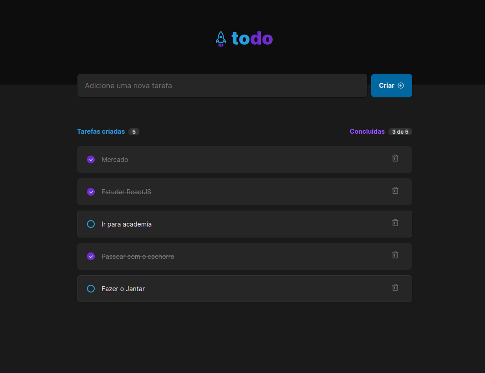

<a id="topo"></a>



<p align="center">
  <a href="https://github.com/RicardoOliveiraFilho">
    
  </a>
  
<p>

<p align="center">
  <a href="#features">Features</a> •
  <a href="#pre-requisitos">Pré-requisitos</a> •
  <a href="#rodando">Rodando a Aplicação</a> •
  <a href="#tecnologias">Tecnologias</a> •
  <a href="#autor">Autor</a>
</p>

### Features<a id="features"></a> - <a href="#topo">Topo</a>
- [x] Inserção de um novo ToDo na listagem.
- [x] Remoção de um ToDo da listagem.
- [X] Marcação de um ToDo na listagem como Concluído ou não.

<h4  align="left">
Projeto finalizado ✔
</h4>

###  Pré-requisitos<a id="pre-requisitos"></a> - <a href="#topo">Topo</a>

Antes de começar, você vai precisar ter instalado em sua máquina as seguintes ferramentas:
 [Git](https://git-scm.com/),
 [Node.js](https://nodejs.org/pt-br/) 
 e [React](https://reactjs.org/).
 
Além disto é bom ter um editor para trabalhar com o código como [VSCode](https://code.visualstudio.com/).
  
### Rodando a Aplicação<a id="rodando"></a> - <a href="#topo">Topo</a>
   
````bash 
 # Clone este repositório
 git clone https://github.com/RicardoOliveiraFilho/todo-app.git 
 # Acesse a pasta do projeto no terminal, a partir do diretório ao qual o comando de clonagem foi executado
 cd todo-app
 
 # Instale as dependências
 $ yarn ou
 $ npm i 
 
 # Execute a aplicação em modo de desenvolvimento
 $ npm run dev 
 $ yarn dev
 
 # O servidor iniciará na porta:3000
 # Acesse http://localhost:3000
 ````
<p> Quando você tiver realizado todos os passos do projeto verá a  <a href="./github/tela-todo-app.png" >imagem do projeto</a> </p>

### Tecnologias<a id="tecnologias"></a> - <a href="#topo">Topo</a>
 As seguintes ferramentas foram usadas na construção do projeto:
 
  - [CSS](https://developer.mozilla.org/pt-BR/docs/Web/CSS)
  - [Node.js](https://nodejs.org/pt-br/)
  - [React](https://reactjs.org/)

### Autor <a id="autor"> </a> - <a href="#topo">Topo</a>

<a href="https://github.com/RicardoOliveiraFilho" style="text-decoration: none;">

<span> Feito por Ricardo Oliveira - Entre em contato! </span> 
</a>
